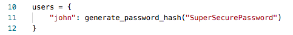
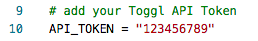
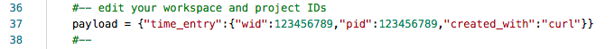
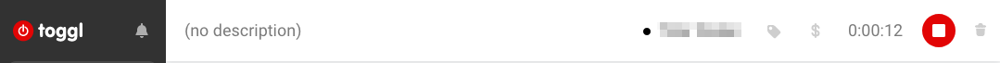
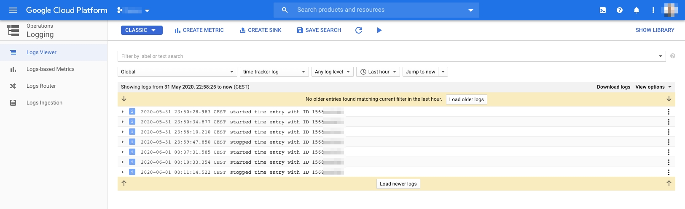

# Simple time tracking webservice

Aim of this project is to provide a simple time tracking webservice for starting and stopping [Toggl](https://toggl.com/) time entries. This webservice can then be used by various apps and services, e.g. [Apple iOS Shortcuts](https://thesweetsetup.com/ios-shortcuts-guide/) to enable location-based time tracking. 

All you need is:

* Toggl account
* Google Cloud Platform account

We will use the [Toggl API](https://github.com/toggl/toggl_api_docs) for starting and stopping time entries and [Google App Engine](https://cloud.google.com/appengine) to host a Python [Flask](https://flask.palletsprojects.com/) application which will be used as an HTTP API. Clients will use HTTP GET requests to start/stop time entries and must authenticate themselves first using [HTTP Basic Auth](https://flask-httpauth.readthedocs.io/en/latest/). 

In the end, we will have the following HTTP endpoints:

* ```https://<URL>/start``` for starting time tracking
* ```https://<URL>/stop``` for stopping time tracking

## Pre-Requirements

1.) Go to your [Toggl Profile Settings](https://toggl.com/app/profile) and copy your API token.

2.) Use the following commands to get your Toggl workspace and project ID. Replace ```<API-TOKEN>``` with your API token and ```<WORKSPACE-ID>``` with your workspace ID. 

```
# workspace ID
curl -sk -u <API-TOKEN>:api_token \
  -X GET https://www.toggl.com/api/v8/workspaces | jq '.[0].id'

# project ID
curl -sk -u <API-TOKEN>:api_token \
  -X GET https://www.toggl.com/api/v8/dashboard/<WORKSPACE-ID> \
  | jq '.activity[0].project_id'
```
If you're unfamiliar with ```jq``` or already have a few workspaces and projects in Toggl, just use the native curl command without piping jq and manually search for the information. 

3.) Prepare your App Engine environment using [this guide](https://cloud.google.com/appengine/docs/standard/python3/quickstart). You don't need to deploy the Hello World App from Google, just make sure ```gcloud``` is installed and configured. 

## Setup Flask app

Have a look at [main.py](main.py):

* Edit the user credentials!

	

Have a look at [run.py](tasks/run.py):

* Edit the Toggl API Token

	

* Edit your workspace and project IDs

	

Deploy the Flask app in Google App Engine:

```
ubuntu@8b954b594:~$ gcloud app deploy
Services to deploy:

descriptor:      [/path/to/app.yaml]
source:          [/path]
target project:  [project-123456]
target service:  [default]
target version:  [20200101t123456]
target url:      [https://project-123456.ey.r.appspot.com]


Do you want to continue (Y/n)?  y

Beginning deployment of service [default]...
╔════════════════════════════════════════════════════════════╗
╠═ Uploading 1 file to Google Cloud Storage                 ═╣
╚════════════════════════════════════════════════════════════╝
File upload done.
Updating service [default]...done.                                                                                                                                                                                  
Setting traffic split for service [default]...done.                                                                                                                                                                 
Deployed service [default] to [https://project-123456.ey.r.appspot.com]

You can stream logs from the command line by running:
  $ gcloud app logs tail -s default

To view your application in the web browser run:
  $ gcloud app browse
```

## Test the webservice

Access ```https://<URL>/start``` and ```https://<URL>/stop``` (you find the URLs in the app-deploy output) using your browser or any other HTTP client. You should get some JSON data as response. 

In Toggl, the desired time entry should get started:



You should also see some logs in the [Log Console](https://console.cloud.google.com/logs). Make sure you select the ```time-tracker-log``` in the ```Global``` resources. 



